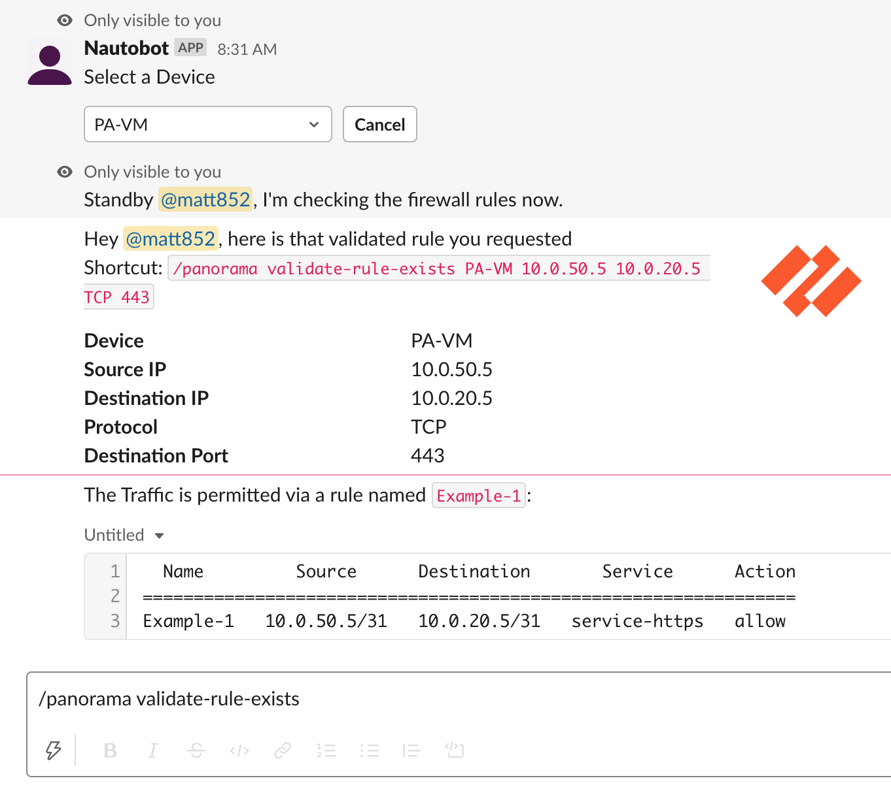
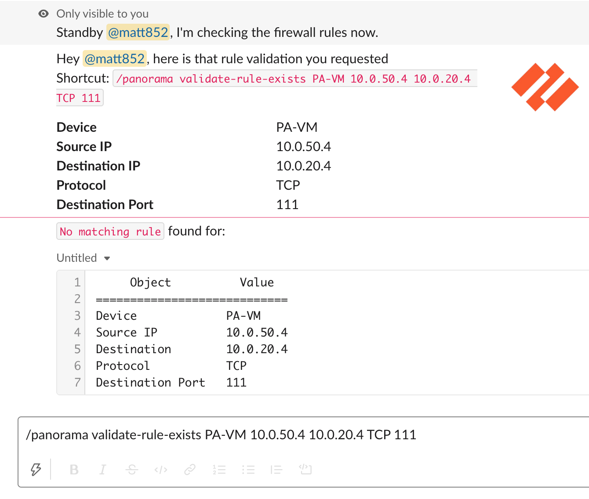
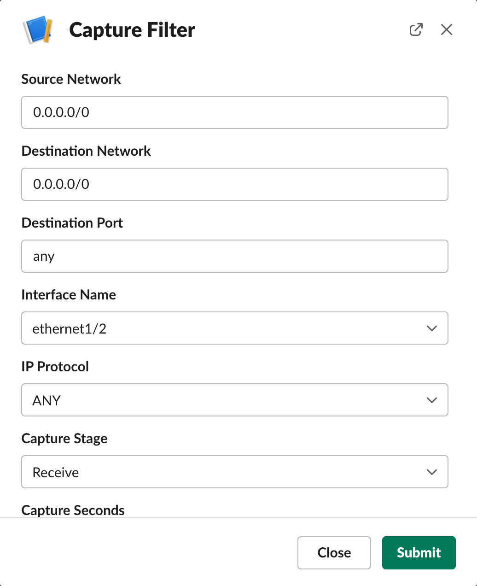
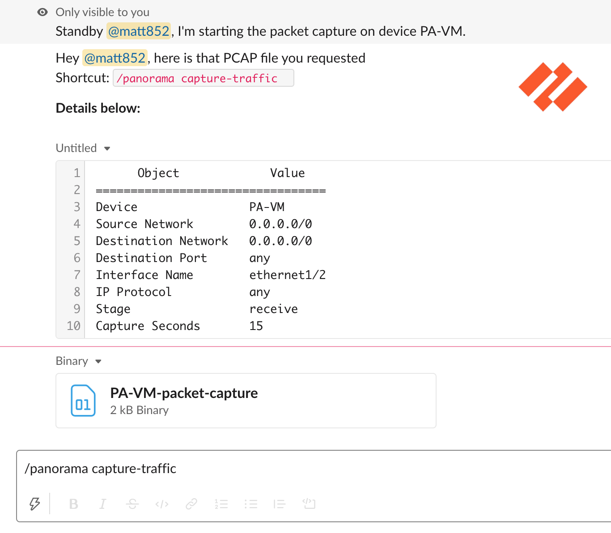

# Nautobot Plugin Chatops Panorama

A plugin for [Nautobot](https://github.com/nautobot/nautobot).

## Prerequisites

This plugin requires the [Nautobot ChatOps Plugin](https://github.com/nautobot/nautobot-plugin-chatops) to be installed and configured before using. You can find detailed setup and configuration instructions [here](https://github.com/nautobot/nautobot-plugin-chatops/blob/develop/README.md).

## Installation

The plugin is available as a Python package in pypi and can be installed with pip:

```shell
pip install nautobot-plugin-chatops-panorama
```

> The plugin is compatible with Nautobot 1.1.0 and higher

To ensure Nautobot Plugin ChatOps Panorama is automatically re-installed during future upgrades, create a file named `local_requirements.txt` (if not already existing) in the Nautobot root directory (alongside `requirements.txt`) and list the `nautobot-plugin-chatops-panorama` package:

```no-highlight
# echo nautobot-plugin-chatops-panorama >> local_requirements.txt
```

Once installed, the plugin needs to be enabled in your `nautobot_config.py`

```python
# In your configuration.py
PLUGINS = ["nautobot_chatops", "nautobot_plugin_chatops_panorama"]
```

### Environment Variables

You will need to set the following environment variables for your Nautobot instance, then restart the services for them to take effect.

* PANORAMA_HOST - This is the management DNS/IP address used to reach your Panorama instance.
* PANORAMA_USER - A user account with API access to Panorama.
* PANORAMA_PASSWORD - The password that goes with the above user account.

## Access Control

Just like with the regular `/nautobot` command from the base Nautobot ChatOps plugin, the `/panorama` command supports access control through the Access Grants menu in Nautobot. See section [Grant Access to the Chatbot](https://github.com/nautobot/nautobot-plugin-chatops/blob/develop/docs/chat_setup/chat_setup.md#grant-access-to-the-chatbot) in the installation guide for the base Nautobot ChatOps plugin for setting this up.

## Usage

The supported commands are listed below. We welcome any new command or feature requests by submitting an issue or PR.

| /panorama Command     | Description                           |
| --------------------- | ------------------------------------- |
| capture-traffic       | Run a packet capture on PANOS Device for specified IP traffic. |
| export-device-rules   | Generate a downloadable list of firewall rules with details in CSV format. |
| get-device-rules      | Return a list of all firewall rules on a given device with details. |
| get-version           | Obtain software version information for Panorama. |
| install-software      | Install software to specified Palo Alto device. |
| upload-software       | Upload software to specified Palo Alto device. |
| validate-rule-exists  | Verify that a specific ACL rule exists within a device, via Panorama. |

## Questions

For any questions or comments, please check the [FAQ](FAQ.md) first and feel free to swing by the [Network to Code slack channel](https://networktocode.slack.com/) (channel #networktocode).
Sign up [here](http://slack.networktocode.com/)

## Screenshots









